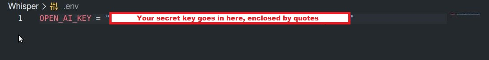

# Whispr

Whispr is an application of `gpt-3.5-turbo`. The current goal of this project is to:

1. Explore the modularity of GPT when used programmatically.
      - Whispr can make external API calls. This means that it can analyze large amounts of data and provide actionable insights.

2. Explore ways to make prompt engineering accessible to users.
      - Users should be able to specify the output format of their responses with a simple front-end UI.

## An Informal Business Case

ACME is a fintech consulting company who uses an integrated ERP system called "Trackr".

### Problems

1. ACME managers have complained that Trackr's UI is a mile-wide and an inch-deep.
      - Accessing simple utilization reports can be a hassle.

2. Trackr tends to give generic insights, based on hard-coded responses.
      - "This project has fallen below 85% utilization. Maybe you should look into it."

### Objectives

1. Provide deeper insights into data, with the ingenuity of AI.

2. Bypass the frontend of a web application, with Javascript and RESTful API practices.

### Proposed Solution

1. Whispr connects to the Trackr API via endpoint access.

2. Whispr requests a Trackr project report on ACME's largest client, "BigCorp".

3. Whispr parses the response with Javascript.

4. Using the parsed response, Whispr sends an engineered prompt to the GPT API.

5. Whispr outputs a digest of the project report, based on hard data.

# Table of Contents

- [Getting Started](#getting-started)
  - [Prerequisites](#prerequisites)
  - [Installation](#installation)
- [Usage](#usage)
- [Configuration](#configuration)
  - [Setting up the secret key](#setting-up-the-secret-key)
  - [Customizing Prompts](#customizing-prompts)
- [Contributing](#contributing)
- [License](#license)

## Getting Started

These instructions will help you get the project up and running on your local machine for development and testing purposes.

### Prerequisites

To run this project, you need to have the following software installed:

- Node.js - [Download and Install Node.js](https://nodejs.org)
- npm - Usually comes bundled with Node.js

### Installation

1. Clone the repository:
      ```bash
      git clone https://github.com/your-username/your-repository.git
2. Install dependencies via CLI:
      ```bash
      npm install

### Usage

1. Open your terminal emulator of choice
2. Navigate to the local Whispr project folder via CLI
3. Run `node app` or `node app.js` to make the API request

## Configuration

### Setting up the secret key

1. Create a .env file in your local repository and enter your API key, named `OPEN_AI_KEY`
2. The contents of the .env file will look like this:



### Customizing Prompts

Work in progress...

## Contributing

Message me if you're getting started on your own AI-related projects too! I'd love to collaborate!

## License

Feel free to modify the content to match your project's specifics, such as project name, description, prerequisites, installation steps, usage instructions, configuration details, contribution guidelines, and license information.

Remember to update the relevant sections with the actual instructions and information specific to your project. Good luck!