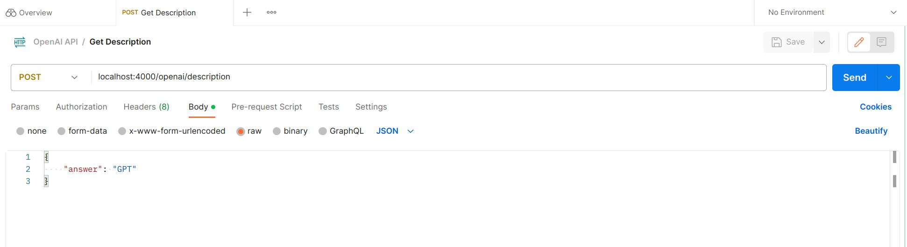

# Whispr

# Table of Contents

- [Overall Objectives](#overall-objectives)
- [Use Case](#use-case)
  - [Problem](#problem)
  - [Solution](#solution)
- [Getting Started](#getting-started)
  - [Prerequisites](#prerequisites)
  - [Installation](#installation)
- [Usage](#usage)
- [Configuration](#configuration)
  - [Setting up the secret key](#setting-up-the-secret-key)
  - [Customizing Prompts](#customizing-prompts)
- [Contributing](#contributing)
- [License](#license)
- [Q&A](#qa)

## Overall Objectives

1. Explore the modularity of GPT when used programmatically.

   - `Whispr` can make external API calls to OpenAI API and GitHub API. It can analyze large amounts of data and provide actionable insights.

2. Explore methods to make prompt engineering accessible to users.

   - Users should be able to customize their prompts in an accessible frontend UI.

3. _Don't reinvent the wheel._

   - I'm only building the backbone of this web app to handle user interaction and server requests. `gpt-3.5-turbo` does the heavy lifting by delivering novel, creative, and structured roadmaps.

## Use Case

`Whispr` is a simple web app that helps aspiring developers plan their projects, from beginning to end.

### Problem

1. Lack of long-term planning, leading to scope creep:

   - Aspiring developers spend the majority of their time practicing languages and frameworks. Project planning is usually an afterthought, after some code has already been written.

2. Lack of clarity in tech stack selection:

   - Aspiring developers often struggle to choose the right technologies for their projects. They need guidance on selecting appropriate programming languages, frameworks, and tools based on project requirements and industry trends.

### Solution

1. Select from a list of relevant technologies, such as `HTML`, `CSS`, `Bootstrap`, `Javascript`, `Python`, `Express`, `SQL`, `MongoDB`, and so on...

2. Generate a list of project ideas that incorporate selected technologies. The user chooses their favorite project idea.

3. Generate a project roadmap, based on the selected idea.

   - For each phase in the roadmap, `Whispr` generates insight on _how_ to integrate the selected technologies.

4. Find open-source projects on GitHub that have already incorporated the selected technologies.

   - GitHub API enables `Whispr` to seek repositories based on their tags, such as `javascript` and `bootstrap`.

## Getting Started

These instructions will help you get the project up and running on your local machine for development and testing purposes.

### Prerequisites

To run this project, you need to have the following software installed:

- Node.js - [Download and Install Node.js](https://nodejs.org)
- npm - Usually comes bundled with Node.js
- Postman - Only necessary for API testing and development

### Installation

1. Clone the repository:
   ```bash
   git clone git@github.com:peterahn8/Whispr.git
   ```
2. Install dependencies via CLI:
   ```bash
   npm install
   ```

## Usage

1. Open your terminal emulator of choice
2. Navigate to the local `Whispr` project folder via CLI
3. Run `node src/server/server.js` to start the server
4. Run Postman and submit your API requests. The body of the request looks like this:



## Configuration

### Setting up the secret key

1. Create a .env file in your local repository and enter your API key, named `OPEN_AI_KEY`
2. The contents of the .env file will look like this:


### Customizing Prompts

Work in progress...

## Contributing

If you'd like to collaborate, please message me! The project is not in MVP stage yet, but I'm all ears if you have advice.

Also, if you're getting started on your own AI-related projects, I'd love to learn more about them!

## License

Feel free to modify the content to match your project's specifics, such as project name, description, prerequisites, installation steps, usage instructions, configuration details, contribution guidelines, and license information.

Remember to update the relevant sections with the actual instructions and information specific to your project. Good luck!

## Q&A

1. "ChatGPT can already solve this problem. Just ask it for project ideas."

   - This is true, but `Whispr` turns project planning into a modular process. You can easily enable/disable selected technologies, rather than asking ChatGPT questions ad-nauseam.

2. "Does `Whispr` give advice on how to code?"

   - No. In an effort to minimize the scope of `Whispr`, it will not teach developers how to code. It will only give actionable insight on how to integrate their tech stack in a project.

3. "Is this scalable? How would you cover the token cost of a user's requests to OpenAI API?"

   - That's a great question. I'm planning to implement OAuth and rate-limiting to limit the overhead costs.
   - Another option is to require users to build `Whispr` locally and use their own secret keys.

4. "The Usage and Configuration instructions are unclear for developers who want to contribute."

   - All of the build instructions are still work-in-progress. I will be updating them as I build out `Whispr`.
